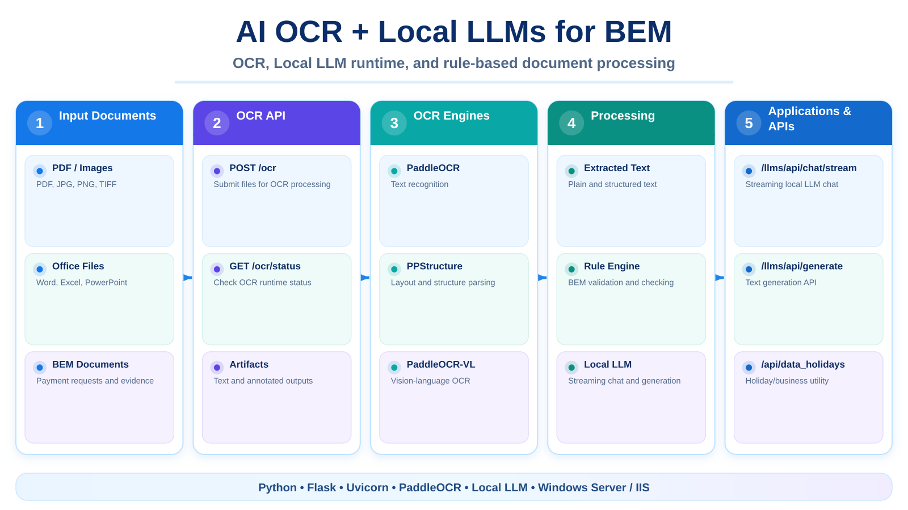

# 🤖 AI OCR + Local LLMs for BEM

> Hệ thống **OCR + Local LLM + Rule Engine** phục vụ đọc chứng từ, trích xuất dữ liệu và hỗ trợ đối chiếu nghiệp vụ BEM/ĐNTT.

\n  \n
\n
---

## 📌 Giới thiệu

AI_OCR_LLMs là backend AI bằng Python tập trung vào ba nhóm xử lý chính:

- 📄 **OCR tài liệu**: nhận PDF, ảnh và tài liệu Office, trích xuất nội dung thành text và tạo ảnh annotate.
- 🧠 **LLM cục bộ**: quản lý model local, chat streaming, sinh nội dung và huấn luyện LoRA.
- ✅ **Rule nghiệp vụ BEM**: kết hợp dữ liệu OCR/LLM với các rule Python để phục vụ luồng kiểm tra chứng từ.

Source hiện tại được thiết kế để chạy trên Windows Server/IIS hoặc chạy trực tiếp bằng Uvicorn.

---

## 🚀 Chức năng chính

- 🔎 OCR nhiều file qua POST /ocr.
- 🧾 Hỗ trợ PDF, ảnh, Word, Excel và PowerPoint.
- 🧠 Hỗ trợ nhiều engine OCR, gồm luồng PPStructure/PaddleOCR và PaddleOCR-VL.
- 📊 Trả text tổng hợp, artifact và ảnh annotate sau OCR.
- 💬 Chat với Local LLM theo cơ chế streaming.
- 📦 Load / unload / reload model LLM trong runtime.
- 🔐 Hỗ trợ token cho giao diện LLM local.
- 🏋️ Huấn luyện LoRA từ dữ liệu trong App/LLMs_Train.
- 🧩 Tích hợp rule nghiệp vụ BEM trong Rules_AI_BEM_MEIKO.py.
- 📅 API dữ liệu ngày nghỉ để hỗ trợ các rule liên quan thời hạn thanh toán.

---

## 🏗️ Kiến trúc tổng quan

~~~text
PDF / Image / Office
        │
        ▼
   POST /ocr
        │
        ▼
OCR Engine
PPStructure / PaddleOCR-VL
        │
        ▼
Text + Annotated Images
        │
        ├──────────────► Rule nghiệp vụ BEM
        │
        ▼
Local LLM Runtime
Transformers / PyTorch
        │
        ▼
Kết quả trích xuất / phân tích / đối chiếu
~~~

Backend dùng Flask cho API chính và được bọc WSGI → ASGI để chạy bằng Uvicorn.

---

## 🔌 API chính

| API | Method | Mục đích |
|---|---|---|
| /ping | GET | Kiểm tra server |
| /ocr/status | GET | Xem OCR engine đang hoạt động |
| /ocr | POST | OCR file/tài liệu |
| /Outputs/<path> | GET | Đọc artifact đã sinh |
| /annot-list | GET | Danh sách ảnh annotate |
| /llms/api/health | GET | Kiểm tra LLM service |
| /llms/api/models | GET | Danh sách model |
| /llms/api/models/load | POST | Load model |
| /llms/api/models/unload | POST | Unload model |
| /llms/api/models/reload | POST | Reload model |
| /llms/api/chat/stream | POST | Chat streaming |
| /llms/api/generate | POST | Sinh nội dung |
| /api/data_holidays | POST | Xử lý dữ liệu ngày nghỉ |

Giao diện test:

- OCR UI: /ocr/
- Local LLM UI: /llms/

---

## 🛠️ Công nghệ sử dụng

- 🐍 **Python**
- 🌐 **Flask + Uvicorn + ASGI**
- 👁️ **PaddleOCR / PaddleX / PaddleOCR-VL**
- 🔥 **PyTorch**
- 🤗 **Hugging Face Transformers**
- 🧠 **Local LLM runtime**
- 🏋️ **PEFT / LoRA**
- 🖥️ **HTML / JavaScript** cho giao diện OCR và LLM
- 🪟 **Windows Server / IIS** cho môi trường triển khai

---

## 📂 Cấu trúc dự án

~~~text
AI_OCR_LLMs/
├── App/
│   ├── main_iis.py              # Flask API chính
│   ├── settings_all.py          # Cấu hình runtime tập trung
│   ├── OCR_BE/                  # OCR pipeline
│   ├── LLMs_BE/                 # Local LLM integration
│   ├── LLMs_Train/              # LoRA training
│   └── Rules_AI_BEM_MEIKO.py    # Rule nghiệp vụ BEM
├── UI/
│   ├── index_ocr.html           # OCR UI
│   ├── index_llms.html          # LLM UI
│   └── static/
├── Prompt_AI_BEM_v11/           # Prompt theo loại ĐNTT
├── docs/                        # Tài liệu triển khai / OCR
├── Models/                      # Model local - không commit binary nặng
├── run_server.py                # Chạy server
├── run_train.py                 # Chạy LoRA training
├── run_test.py                  # Công cụ test
├── requirements.txt
└── web.config                   # IIS configuration
~~~

---

## ⚙️ Cài đặt và chạy

### 1. Clone repository

~~~bash
git clone https://github.com/tttiuem2k3/AI_OCR_LLMs.git
cd AI_OCR_LLMs
~~~

### 2. Tạo môi trường Python

~~~bash
python -m venv .venv
.venv\Scripts\activate
pip install -r requirements.txt
~~~

> PaddlePaddle/PaddleOCR và PyTorch được cài riêng theo GPU/CUDA của máy. Tham khảo docs/DEPLOY_WINDOWS_SERVER_GPU.md.

### 3. Chạy server

~~~bash
python run_server.py
~~~

Model OCR/LLM được cấu hình trong App/settings_all.py và các thư mục model local. Các binary model lớn không được lưu trực tiếp trên Git.

---

## 🧪 Huấn luyện LoRA

Dữ liệu training được chuẩn bị trong App/LLMs_Train/data/.

~~~bash
python run_train.py
~~~

Pipeline hỗ trợ chuẩn bị dữ liệu, tokenize và fine-tune model bằng PEFT/LoRA.

---

## 📚 Tài liệu trong repo

- CLIENT_API_GUIDE.md – hướng dẫn tích hợp API.
- docs/DEPLOY_WINDOWS_SERVER_GPU.md – triển khai Windows Server + GPU.
- docs/OCR/ – ghi chú và notebook huấn luyện OCR.
- Prompt_AI_BEM_v11/ – prompt nghiệp vụ theo nhóm chứng từ/ĐNTT.

---

## 📞 Liên hệ

- 📧 Email: tttiuem2k3@gmail.com
- 👥 LinkedIn: [Thịnh Trần](https://www.linkedin.com/in/thinh-tran-04122k3/)
- 💬 Zalo / Phone: +84 329966939 | +84 336639775

---
